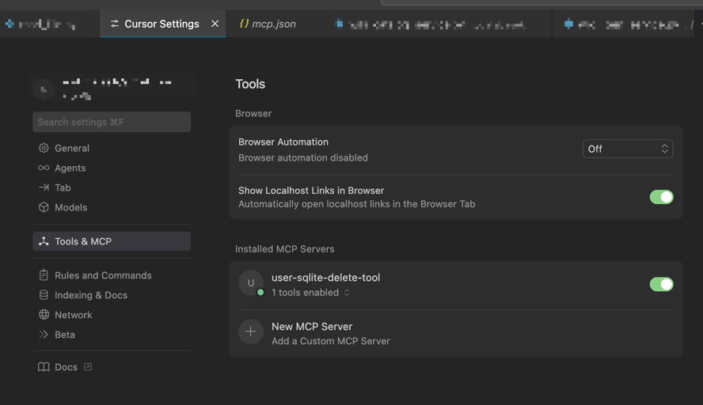
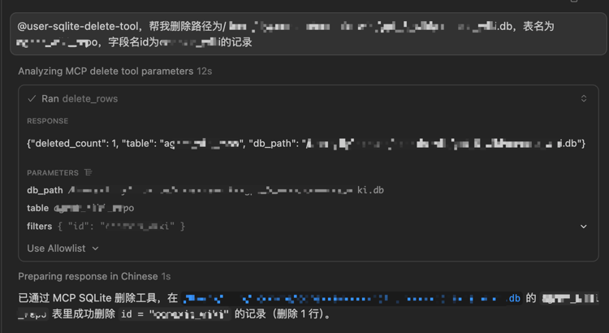

## SQLite MCP 工具（仅删除功能）

该项目实现了一个基于 Python 的 MCP 工具，仅提供 **删除 SQLite 表数据** 的能力（`delete_rows`）。  
调用方可以指定数据库路径、表名，以及简单的等值过滤条件来执行 `DELETE` 操作。

### 功能概览

- `delete_rows`：从指定的 SQLite 数据库表中删除符合条件的记录。
  - 必填参数：`db_path`（数据库路径）、`table`（表名）
  - 可选参数：`filters`（简单等值条件字典）、`allow_full_table`（是否允许整表删除）

### 目录结构

- `agent-cli/`
  - `README.md`：项目说明
  - `requirements.txt`：Python 依赖
  - `sqlite_mcp/`：主源码目录
    - `__init__.py`
    - `server.py`：MCP 工具服务实现与入口
    - `delete_tool.py`：核心删除逻辑
  - `docs/`
    - `delete_rows_spec.md`：`delete_rows` 方法需求与接口说明
  - `tests/`
    - `test_delete_rows.py`：简单单测，可通过 `python tests/test_delete_rows.py` 运行

### 运行说明（示意）

1. 安装依赖（建议在虚拟环境中）：

```bash
cd agent-cli
pip install -r requirements.txt
```

2. 启动 MCP 服务器（示意，具体看你的 Agent/宿主如何集成 MCP）：

```bash
cd agent-cli
python -m sqlite_mcp.server
```

3. 在支持 MCP 的 Agent 中注册该服务，并调用 `delete_rows` 方法。 

cursor 注册示例：

```bash
{
  "mcpServers": {
    "user-sqlite-delete-tool": {
      "command": "/Users/XXX/.mcp/sqlite-tool/.venv/bin/python",
      "args": [
        "-m",
        "sqlite_mcp.server"
      ],
      "env": {
        "PYTHONPATH": "/Users/XXX/.mcp/sqlite-tool/agent-cli"
      }
    }
  }
}
```


使用示例：
@user-sqlite-delete-tool，帮我删除路径为/Users/XXX/XXX.db，表名为BBB，字段名id为CCC的记录


